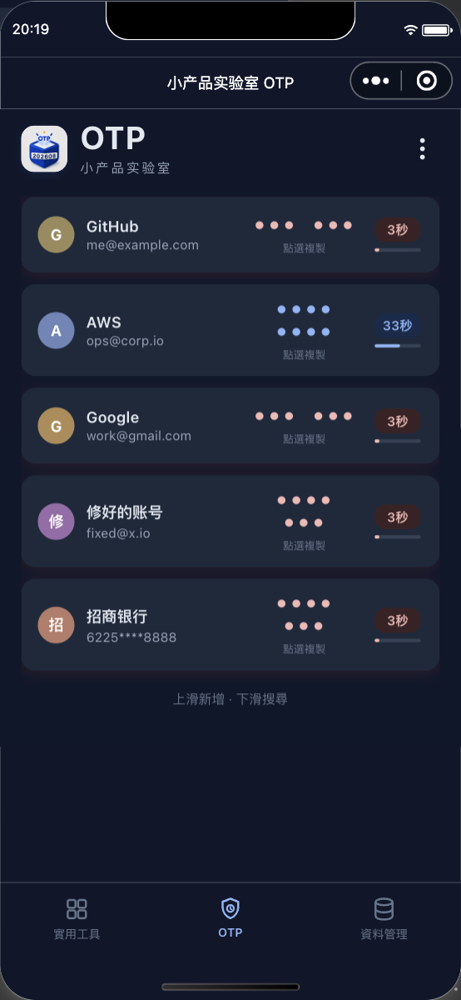

# 小产品实验室 OTP

一个本地优先的微信小程序：管理 TOTP 动态验证码、静态密码账本与加密备份。

> 不需要注册项目账号。验证码在设备本地计算；需要备份时，用户可导出加密文件，或手动上传到自己的 WebDAV 空间。



## 体验小程序

使用微信扫一扫，即可打开「小产品实验室 OTP」。无需注册项目账号。

<p align="center">
  
</p>

正式介绍页：[otp.tinylabpro.com](https://otp.tinylabpro.com/)

## 功能

- 扫码或手动添加 TOTP 验证码
- 本地计算验证码，支持搜索、排序、复制与迁移二维码
- 静态密码账本、弱密码与重复密码提示
- 随机密码生成器
- 加密备份：微信文件导入导出、坚果云 WebDAV 手动备份
- 简体中文、英语、日语、繁体中文；品牌名“小产品实验室”固定保留

## 数据与隐私

- 不建立项目账号体系，也没有项目方的数据同步服务器。
- OTP 验证码在本地按标准算法生成。
- WebDAV 备份由用户主动发起，上传的是加密备份文件。
- 小程序不具备系统级自动填充与后台定时备份能力；重要账号请同时保存服务方的备用恢复码。

## 本地运行

1. 安装并打开微信开发者工具。
2. 选择“导入项目”，目录选择本仓库根目录。
3. 使用自己的小程序 AppID；仅本地体验也可使用测试 AppID。
4. 点击编译后，在模拟器或真机预览中测试。

```bash
node _test/verify-pages.js
```

当前项目包含页面和核心逻辑的自动化检查。

## 项目结构

```text
pages/      小程序页面
utils/      TOTP、加密备份、WebDAV、密码与本地存储逻辑
styles/     主题与颜色变量
_test/      本地回归检查
docs/       项目说明、真实截图与设计资料
site/       开源项目主页（GitHub Pages）
```

## 贡献

欢迎提交 Issue 或 Pull Request。请不要提交真实 OTP 密钥、WebDAV 应用密码、个人账号信息或备份文件。

## 请喝咖啡

小产品实验室的工具会持续免费维护。若它对你有帮助，欢迎扫码赞赏；你的支持会用于服务器、测试设备和产品持续打磨。

<p align="center">
  
  
</p>

<p align="center">微信赞赏　·　支付宝赞赏</p>

## 许可证

[MIT License](LICENSE)
