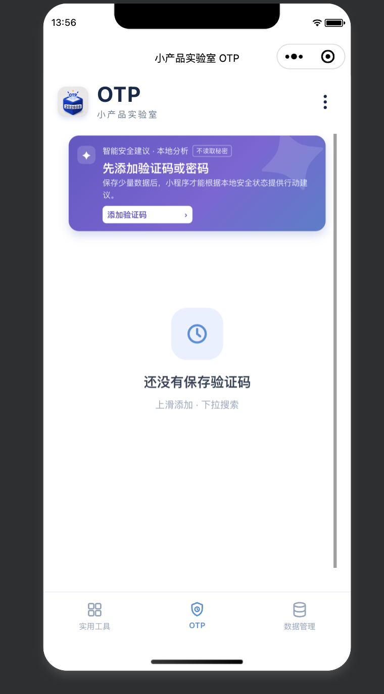
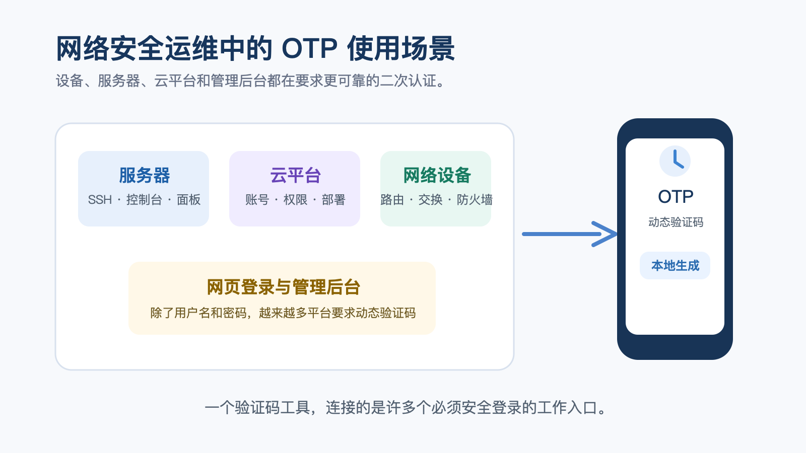
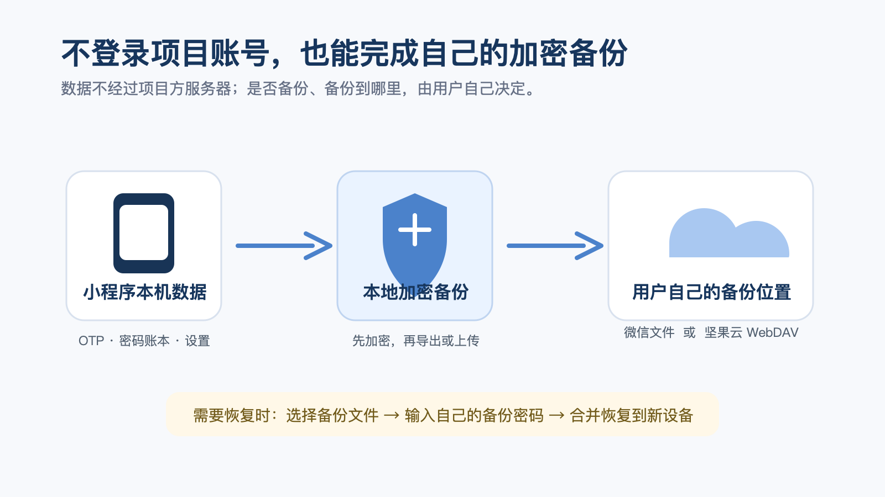
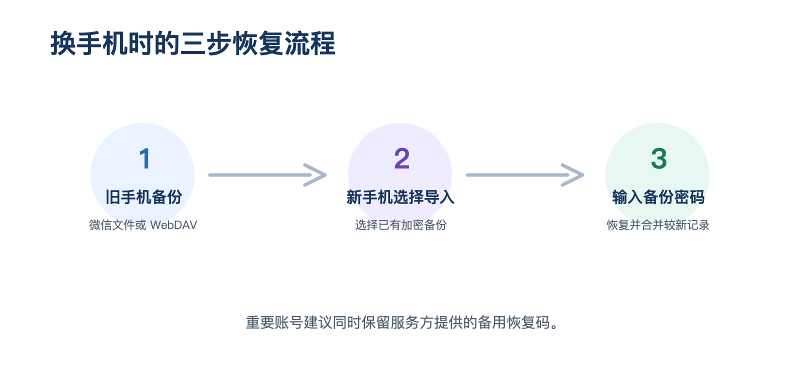
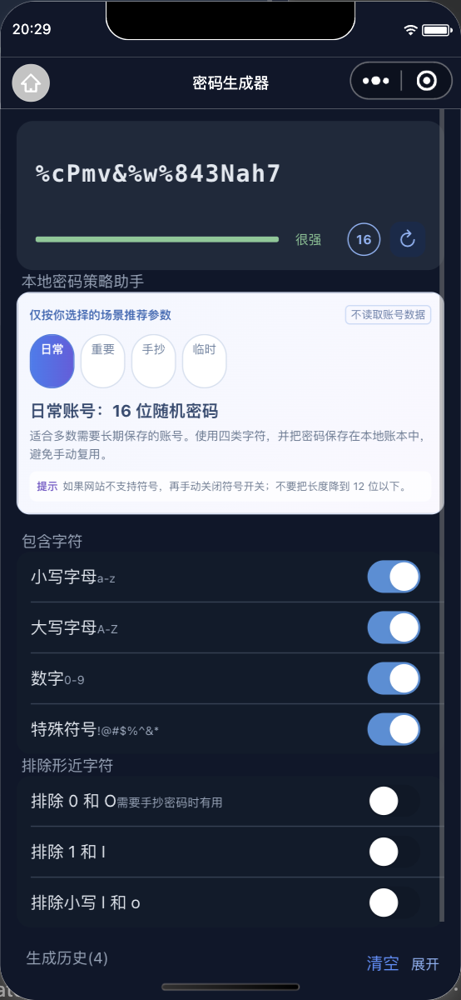
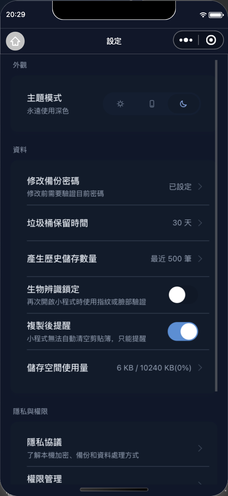

# 小产品实验室 OTP｜项目说明与创作过程

## 一、项目概述

**小产品实验室 OTP** 是一款面向微信用户的本地优先安全工具小程序，用于管理 TOTP 动态验证码、静态账号密码和加密备份。

项目没有自建用户账号体系，也不要求用户注册或登录。验证码默认在设备本地计算与保存；用户可按需将加密备份导出至微信文件，或手动上传至自己配置的坚果云 WebDAV 空间，以便换机后恢复。

项目希望解决的是一个很具体的问题：**人们在开启两步验证后，往往能顺利使用验证码，却容易在换手机、重装微信或设备遗失时，因缺少备份而无法登录重要账号。**



*图 1：小程序在微信开发者工具中的首页预览。首页将“添加验证码”的入口与空状态引导放在显眼位置。*


*图 2：微信开发者工具中真实运行的 OTP 列表，展示多条验证码、倒计时和持续保留的手势提示。*

---

## 二、创作背景

### 1. 动态验证码的“最后一公里”问题

我的工作本身和**网络安全运维**有关，平时接触服务器、网络设备、云平台以及各种管理后台比较多。现在越来越多的平台开始强制或者建议开启二次认证，除了用户名和密码之外，还需要再输入一次动态验证码。

所以工作中，我经常会在手机里保存一些 OTP，用来登录设备、服务器或者各种网页后台。

这几年我一个很明显的感受就是：**账号密码本身不难管理，真正容易被忽略的，是验证码换机、备份和恢复这一步。**平时验证码只需要打开手机看一眼；但一旦旧手机丢失、重装微信或更换设备，少了这一组验证码，即使密码正确，也可能进不了服务器、云平台或管理后台。



*图 3：OTP 往往同时服务于服务器、云平台、网络设备和网页后台。*

现有工具通常有两种取舍：一类需要注册账号并将数据同步到平台云端；另一类功能复杂、学习成本较高。对于只希望快速添加验证码、自己掌握数据和备份位置的用户来说，仍缺少一个轻量、直接的选择。

### 2. 微信小程序的使用习惯

微信小程序适合“打开即用”的轻量场景，但也有明确限制：无法提供系统级自动填充，也不适合承诺后台定时同步。因此，本项目没有追求做成完整的密码管理器，而是把边界定义为：

- 快速录入和查看 OTP；
- 本地管理静态账号密码；
- 由用户主动发起的加密备份与恢复；
- 对弱密码、重复密码和长期未备份情况给出提示。

---

## 三、创作思路

### 1. 本地优先，而不是默认上传

OTP 验证码可以根据密钥和当前时间在本地生成，因此无需在每次查看时连接服务器。项目将验证码、密码记录和备份配置优先保存在微信本地存储中；用户不注册小程序账号，也不需要把内容上传到项目方服务器。

### 2. “无需登录”与“可在线备份”并不矛盾

项目不提供自身账号登录，但允许用户连接**自己的** WebDAV 空间。实际流程是：

```text
本机数据 → 本地加密为备份文件 → 用户主动上传 → 自己的坚果云 WebDAV
```

换机时，用户再从自己的 WebDAV 备份列表下载、输入备份密码并恢复。上传的是加密备份容器，不是可直接读取的验证码或密码内容。

这一设计把“同步位置”的选择权交回用户：不使用 WebDAV 时，可只使用本地和微信文件导出；需要云端备份时，也不会要求用户再注册一套项目账号。



*图 4：备份先在本机加密，再由用户主动导出到微信文件或上传至自己的 WebDAV。*

### 3. 用低门槛交互替代说明书

首页以“上滑添加、下滑搜索”为核心手势，并在没有任何数据时保留操作提示；即使用户已经添加了记录，提示也会留在列表下方，避免第一次使用后就找不到入口。


*图 2：空状态中直接说明“上滑添加、下滑搜索”，降低首次使用门槛。*

---

## 四、主要功能与实践实现

| 模块 | 用户能做什么 | 实践方式 |
| --- | --- | --- |
| OTP 验证码 | 扫码、手动录入、搜索、复制验证码 | 按标准 TOTP 规则在本机计算验证码，不需要联网生成 |
| 静态密码账本 | 保存账号、密码、备注、分组；搜索与排序 | 本地保存，提供手动复制，不承诺系统级自动填充 |
| 密码生成器 | 按长度、字符类型生成随机密码 | 在本地生成，并提供生成历史与复制提醒 |
| 风险提示 | 查看弱密码、重复密码、未备份等提示 | 使用本地规则判断，不读取或上传用户密码内容 |
| 加密备份 | 导出到微信文件、从微信文件恢复 | 先在本地加密成备份文件，再经微信文件能力传递 |
| WebDAV 备份 | 上传、查看并恢复自己的云端备份 | 当前支持坚果云 WebDAV；用户填写账号和应用密码后手动发起 |
| OTP 迁移二维码 | 单条或多条验证码近距离迁移 | 生成加密二维码，可用于换机或临时设备转移 |
| 多语言 | 跟随系统或在菜单中切换 | 支持简体中文、英语、日语、繁体中文；品牌名“小产品实验室”保持不翻译 |

### WebDAV 的通俗使用方法

用户只需要准备：坚果云 WebDAV 地址、坚果云账号和在坚果云创建的**应用密码**。应用密码是给某个应用单独使用的专用密码，建议不要直接填写网盘登录密码。

在小程序“数据管理 → WebDAV 配置”中填好后，点击“立即备份”即可。每次备份都由用户主动确认；这是对微信小程序无法后台长期运行这一限制的明确取舍，而不是遗漏功能。


*图 6：数据管理页将 WebDAV 配置、云端备份与恢复、微信导入导出和回收站集中呈现。*

---

## 五、实践过程

### 阶段 1：确定功能边界

先确定项目不是“什么都做”的安全工具，而是围绕 OTP 的完整使用闭环：**添加 → 查看/复制 → 密码辅助管理 → 备份 → 换机恢复**。这样既保留了核心安全能力，也降低了初次使用成本。

### 阶段 2：构建本地安全流程

项目将 OTP 的生成、密码强度判断和备份文件生成放在本地完成。备份时先要求用户设置备份密码，再生成加密容器；恢复时使用同一密码解密。对于忘记备份密码的情况，项目不提供“找回”机制，避免形成额外的密钥托管风险。



*图 5：通过备份、导入和密码验证三步完成换机恢复。*

### 阶段 3：完善备份与迁移

考虑到用户的实际习惯，项目同时提供两条路径：

1. **微信文件导入导出**：适合快速、离线地把加密备份发给自己或可信设备；
2. **坚果云 WebDAV 备份**：适合希望把备份固定保存在自己云盘中、换机时随时恢复的用户。

对于只迁移少量验证码的场景，则提供加密迁移二维码，避免用户为临时转移而进行完整备份。

### 阶段 4：优化首次使用与可理解性

项目将添加入口、空状态提示、备份状态、数据管理放在清晰的三栏结构中。通过“先添加验证码或密码”“换手机或卸载微信前请先备份”等直白文案，引导用户完成最重要的安全动作。

同时，语言设置从层级较深的设置页移到右上角菜单，便于国际用户快速切换；首页、设置页和核心提示均接入多语言文案。

### 阶段 5：功能验证

项目对首页、OTP 列表与编辑、密码账本、密码生成器、回收站、设置、备份、加密迁移二维码等主要流程进行了自动化回归验证，当前共通过 **148 项** 页面与逻辑检查。



*图 7：密码生成器支持按日常、重要、手抄、临时场景推荐参数，并可调整字符策略。*



*图 8：设置页展示主题、备份密码、历史保留、权限说明等本地安全选项。*

---

## 六、隐私与安全设计

1. **无需项目账号**：不建立用户账号体系，不以注册登录作为使用前提。
2. **本地处理**：验证码在设备本地计算；基础安全判断也在本地完成。
3. **用户掌握备份去向**：可导出至微信文件，或手动上传到用户自己的 WebDAV。
4. **备份先加密后传递**：上传或转发的是加密备份文件；恢复仍需要备份密码。
5. **不夸大能力**：小程序不提供系统级自动填充，也不提供后台自动定时备份；重要账号仍建议保留服务方提供的备用恢复码。

---

## 七、创新点与价值

- **轻量化安全闭环**：将 OTP、密码账本、备份、迁移集中在一个打开即用的小程序中。
- **无项目账号的自主备份**：不依赖项目方云端账号，用户可自行决定是否连接自己的 WebDAV。
- **双路径恢复设计**：微信文件适合快速导出，WebDAV 适合稳定留存，二维码适合近距离迁移。
- **将安全提示融入日常操作**：不以复杂术语吓退用户，而是在未备份、弱密码等场景给出下一步可执行建议。
- **可理解的边界**：明确告知哪些事在本地完成、哪些操作需要用户主动发起，避免“自动同步”“绝对安全”等容易误导的表述。

## 八、后续计划

后续会继续完善更多页面的多语言覆盖、备份状态提示和实际设备兼容性测试；同时根据用户反馈优化 WebDAV 配置引导。在不改变“本地优先、无需项目账号、用户掌握备份位置”原则的前提下，持续把安全操作做得更容易理解和完成。
